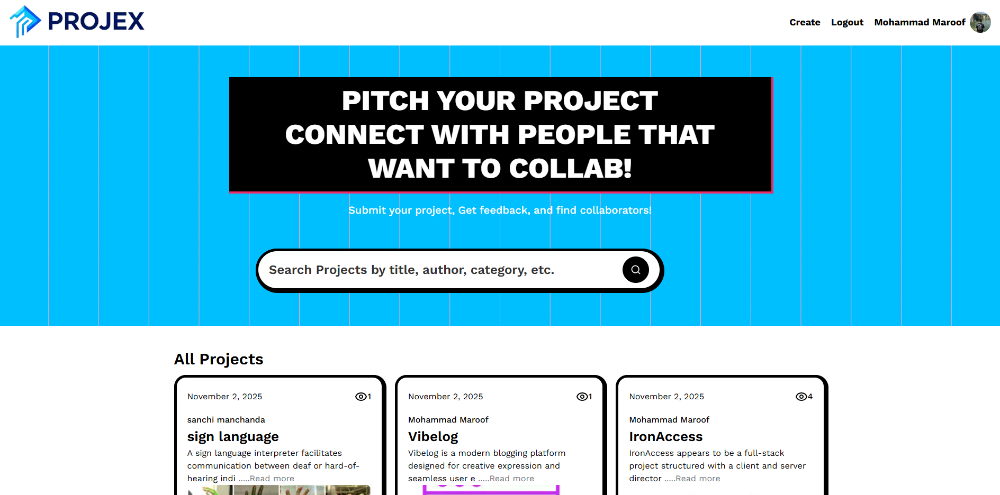
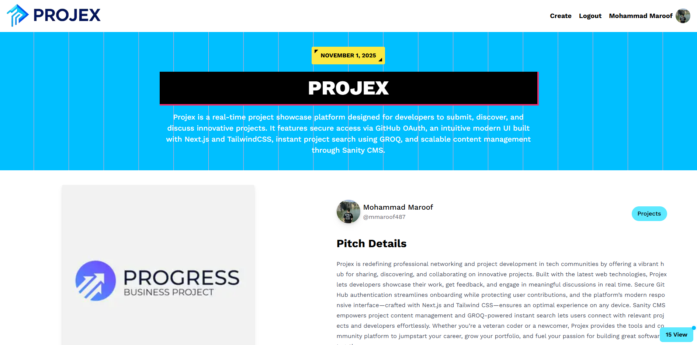
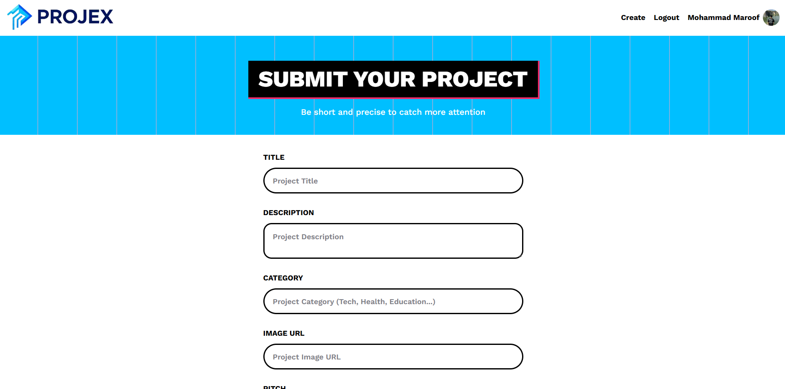

# ProjeX 🚀

A modern platform for developers to upload, showcase, and discover innovative projects — built using **Next.js 15**, **React 19**, **Sanity CMS**, **Tailwind CSS**, and **NextAuth.js**.
Share your work, explore others’, and connect with the tech community in real time.

## 🚧 Live Demo

[projex‑hodo.onrender.com](https://projex-hodo.onrender.com)

> Explore the live platform to see how projects are listed, showcased & interacted with.

## 📸 Screenshots

| Home Page                               | Project Detail                                   | Create Project                                      |
| --------------------------------------- | ------------------------------------------------ | --------------------------------------------------- |
|  |  |  |

## 🧩 Tech Stack

- **Frontend & Framework**: Next.js 15 + React 19
- **Styling**: Tailwind CSS
- **Content / Data**: Sanity CMS (for storing project metadata, user profiles, etc.)
- **Authentication**: NextAuth.js
- **Language**: TypeScript
- **Others**: GROQ (for Sanity queries), configured for modern web dev best‑practices.

## 📂 Project Structure

```
│  README.md
│  next.config.ts
│  tailwind.config.ts
│  tsconfig.json
│
├─ app/                  # Next.js “app” directory – main pages & layout
├─ components/           # Reusable React UI components
├─ hooks/                # Custom hooks
├─ lib/                  # Utility functions, API clients, etc.
├─ public/               # Static assets (images, icons, etc.)
└─ sanity/               # Sanity CMS setup (schemas, config)
```

## 🛠 Getting Started

1. Clone the repo
   ```bash
   git clone https://github.com/mmaroof487/ProjeX.git
   cd ProjeX
   ```
2. Install dependencies
   ```bash
   npm install
   # or
   yarn install
   # or
   pnpm install
   ```
3. Configure environment variables (you’ll need at least):
   ```env
   NEXTAUTH_URL=…
   NEXTAUTH_SECRET=…
   SANITY_PROJECT_ID=…
   SANITY_DATASET=…
   SANITY_API_TOKEN=…
   ```
4. Run development server
   ```bash
   npm run dev
   # or
   yarn dev
   # or
   pnpm dev
   ```
5. Open [http://localhost:3000](http://localhost:3000) in your browser to view the app.

## ✅ Key Features

- User signup/login via NextAuth.js
- Dashboard for developers to upload & manage their projects
- Browse & discover other developers’ projects
- Responsive UI styled with Tailwind CSS
- CMS‑driven content via Sanity for dynamic updates
- Full TypeScript support for safety & scalability

## 🧭 Roadmap & Future Enhancements

- 🔧 Feature: comments & community interactions on projects
- 🎨 Feature: theme switcher (dark/light mode)
- 📱 Feature: Mobile‑first improvements, perhaps a PWA experience
- 📦 Improvements: CI/CD, automated tests, code linting/enforcement
- 🔑 Authentication: Google and Direct Mail login options
- 🪲 Bug Reporting: Integrated Sentry button for easy bug reporting
- 🌐 Project Links: Option to add GitHub repository and live project URL
- ⚠️ UX Fix: Prevent full form reset on single field validation error
- 🧱 UI Improvement: Redesigned card layout on the home screen
- ➕ Enhancement: “Show more / Show less” option for displaying additional project cards
